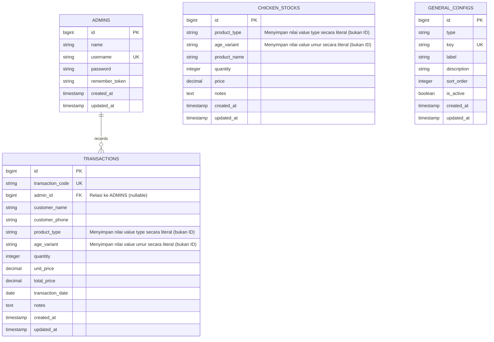

# Entity Relationship Diagram (ERD)

Berikut adalah ERD dari project ini, dirancang menggunakan sintaks Mermaid:

```mermaid
erDiagram
    ADMINS {
        bigint id PK
        string name
        string username UK
        string password
        string remember_token
        timestamp created_at
        timestamp updated_at
    }

    CHICKEN_STOCKS {
        bigint id PK
        string product_type "Menyimpan nilai value type secara literal (bukan ID)"
        string age_variant "Menyimpan nilai value umur secara literal (bukan ID)"
        string product_name
        integer quantity
        decimal price
        text notes
        timestamp created_at
        timestamp updated_at
    }

    GENERAL_CONFIGS {
        bigint id PK
        string type
        string key UK
        string label
        string description
        integer sort_order
        boolean is_active
        timestamp created_at
        timestamp updated_at
    }

    TRANSACTIONS {
        bigint id PK
        string transaction_code UK
        bigint admin_id FK "Relasi ke ADMINS (nullable)"
        string customer_name
        string customer_phone
        string product_type "Menyimpan nilai value type secara literal (bukan ID)"
        string age_variant "Menyimpan nilai value umur secara literal (bukan ID)"
        integer quantity
        decimal unit_price
        decimal total_price
        date transaction_date
        text notes
        timestamp created_at
        timestamp updated_at
    }

    ADMINS ||--o{ TRANSACTIONS : "records"
```
